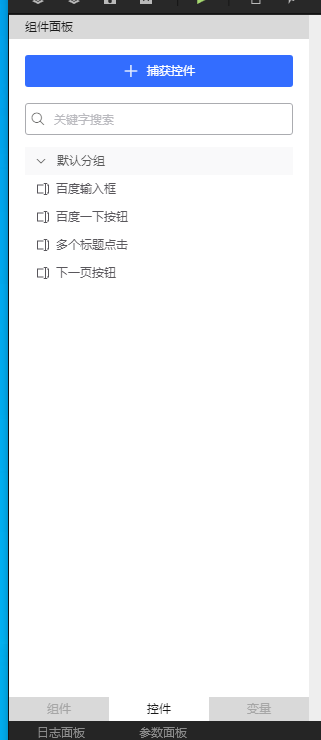

### 一、RPA 机器人自动化流程自动化

**RPA** 的全称为机器人流程自动化（Robotic Process Automation），是一款软件产品，可以模拟人在电脑的不同系统之间操作行为，替代人在电脑前执行具有规律与重复性高的办公流程。

#### 1）RPA发展历程

​        查阅资料我们会发现，在过去的4年时间里，RPA（机器人流程自动化）一词，在Gartner的搜索引擎中一直排名前五。去年Gartner发表的调查数据中显示，RPA行业在2018年保持了60％以上的增长速度，从而成为全球增长最快的智能软件。

* **RPA V1.0阶段**

  **> 实现单个业务操作自动化**

  ​        RPA发展初期，其代表应用：按键精灵。相信大家都不陌生，正如他的名字一样，通过简单的脚本制作，他可以帮助你完成一系列的鼠标按键操作，所以很多游戏玩家喜欢用它来自动打怪升级，当然在工作中，它也可以帮助员工去完成一系列通过点击就可以完成的操作，比如说自动收发邮件、自动调整文档格式等以提升员工工作效率。在这一阶段，RPA几乎涵盖了桌面自动化软件的全部操作，但按键精灵并不能实现多部门合作的业务流程，不能将若干个部门合作的某一业务形成“闭环”，实现端到端的自动化。

* **RPA V2.0阶段**

  **> 实现夸部门协同工作**

  ​        与第一阶段不同，在这一阶段，RPA可以完成一系列的业务流程，并且不受系统软件的控制，游走在各个软件的表面层进行工作，代替人机交互，释放出更多的可能性。

  ​        某财险，每天需要投入200人在各个软件系统之间，对公司客户数据进行相应的查询、汇总、录入、整理、发送等，人工对每个客户操作耗时大概30分钟，此分公司约有20000个客户，每次操作共耗时：30*20000/60=10000小时！

  ​        而借助阿里云RPA的力量，一次录入只需要3分钟，整个流程只需要1个人，整体效率提升900%，从这数据可以看出，阿里云RPA的工作量相当于80个人在同时工作。

* **RPA V3.0阶段**

  **> RPA"上云"**

  ​       曾经美国计算机行业协会做过一次调查，有将近一半的公司表示其31%至60%的IT系统是基于云计算的。81%的公司表示云计算已经显著增强或适度增强了他们在自动化方面的工作。在云计算被炒的火热的今天，众多企业纷纷选择上“云”，开启企业服务业务云端化旅程。RPA弱耦合的特性能够实现跨软件低成本地快速部署，这也造就了RPA上云的必然性—第三阶段——云上RPA。

  ​        云计算不仅为RPA带来了算力的支撑，还节约了其部署成本，另外把RPA部署到云上，不仅没有了软件客户端和场地的限制，一些IT工作人员也可以不用参与其中，在这些技术人员看来，云上的RPA软件始终是最新的，省去了在本地计算机上进行升级的步骤。例如阿里云RPA，已实现在云端运行，远程控制且不占用现有的电脑，并且把RPA部署在云服务器和SaaS上可以实现自动分级、动态负载平衡、情景感知、高级分析和工作流。

* **RPA V4.0阶段**

  **> RPA + AI**

  ​        由于AI智能领域的高速发展，客户对RPA产品的需求已经不仅仅局限于模仿人类基本电脑操作、读写用户界面的能力了。客户需要RPA可以完成从刚开始的执行层到决策层的自我升华，自主开展并完成团队的协同工作。

  ​        AI强大的视觉识别技术可以帮助RPA更加精准的识别并筛选关键图片以及视频信息。目前市场上很多银行、信贷等金融行业对于如何快速完成资料审核一直以来都投入很大程度的关心。审核资料格式多、篇幅长、种类多等业务痛点。阿里云RPA利用阿里达摩院强大的OCR（图像文字识别技术）技术可以帮助客户完成合同审核、材料审核、用户身份证识别、银行卡识别等业务流程，在很大程度上提升了客户工作效率，节约人力成本。

  ​        目前阿里云RPA已经完成从3.0到4.0的规划，未来阿里云RPA将更好的将阿里达摩院技术合理赋能到RPA 技术上，完成阿里云RPA的质的飞跃，未来阿里云RPA将试用与越来越多的行业、场景。

#### 2）RPA的优势

* 容易上手

  不同行业的不同场景职位，其工作流程都是不一样的，所以为了满足客户的不同需求，阿里云RPA开发支持可视化、编码两种开发模式，其强大的可视化开发能力，可以做到开箱即用，即使你不懂技术，没有技术基础，但是只要有业务流程、会简单的电脑操作，那么它就可以满足你的需求。而传统的自动化技术是需要客户有强大的技术编码能力，并且编码语言还要随着使用的自动化工具不同而做出不同的调整，相比较而言难度是很高

* 只运行在表面层级，不改变原有的IT系统

  现在我们办公都会利用各种各样的软件、系统以帮助我们提高工作效率，但是这些系统软件之间又是不通的，这就导致了我们一些工作人员想要完成一件事情需要游走在各个软件之间。而阿里云RPA就不同了，它只是模拟人工点击鼠标、复制、粘贴等的一些正常操作，并且他只运行在软件表面层级，不会侵入影响已有的软件系统的功能与稳定性。通俗的说，RPA是被大家信赖的安全的“外挂”一样的存在。

* 快速部署

  传统的自动化当中，其可行性研究设计和POC验证就花费了大量的时间，而RPA则不同，它是受过程驱动的，阿里云RPA平均孵化一个客户只需要数周的时间，便可以帮助客户实现从定义到上线的全过程。

* 快、很、准

  快即工作效率高；我们知道RPA是一个软件，它跟人类不同，首先它不知疲倦，7x24小时全年无休孜孜不倦的工作。其次它完全不会受心情、身体情况影响工作，也不会出现跟同事聊天、暗中偷懒的事情，再次其工作严谨，出错率基本为0，与人工相比，效率提升不止一点点。
  准即工作准确率高；人力办公，稍有不注意就会出现这样那样的误差，但是RPA绝不会出现这样的情况。以阿里云RPA为例，购买产品之后，通过人工设置工作流程，RPA就可以按照流程去完成工作，如果设置的流程是正确的，那么RPA执行的结果也100%是正确的。
  狠即绝对理性！RPA是一款机器软件，它做事情完全不用考虑人情世故，更不知疲惫，一年365天，一天24小时全年无休的工作。你说它是不是个狠人？

### 二、快速入门

#### 1）百度一下demo

* 创建一个本地工程或者云端工程，创建可视化工程模板

  

* 基础组件

  

  

  

  

  

* 运行结果

  

#### 2）基础可视化工程模板

> 合同系统-签约主体信息管理登记demo

* 创建本地或者云端工程

  

* 基础组件搭建

  

* 运行自动填写表单，提交审批

  

  

#### 3）基础编码工程模板

> demo

* 创建本地或者云端工程

  

* 编写代码

  

* 调试日志

  

* 发布工程

  

### 三、SDK使用

#### 1）ai

~~~python
from rpa.core import *
from rpa.utils import *
import rpa4 as rpa # 使用V4引擎

def start():

    #   ml
    # structure_data(image_path, template_id)
    # 方法描述
    # 结构化模板数据识别
    # 参数说明
    # image_path<str>图片路径
    # template_id<str>结构化模板id
    # 返回值说明
    # 返回结构化识别结果<dict>
    # 调用样例- rpa.ai.ml.structure_data-

    # path = r"C:\Users\Rsion\Desktop\pic\微信图片_20210719142724.png"
    # rpa.ai.ml.structure_data(path,"图片")
    

    #   ocr
    # element_text(element, element_index=1, engine='google', window=None, eliminate_spaces=False)
    # 方法描述
    # 在控件区域中，通过ocr获取所有文本
    # 参数说明
    # element<str>控件名
    # element_index<int>控件位置
    # engine<str>引擎
    # 可选项：
    # google : 谷歌
    # aliyun : 阿里云
    # paddle : 飞桨
    # eliminate_spaces<bool>是否去掉识别结果中的空格
    # window<object>控件所在窗口对象
    # 返回值说明
    # 返回识别结果<str>
    # 调用样例- rpa.ai.ocr.element_text-

    # page = rpa.app.chrome.create("www.taobao.com")
    # text = rpa.ai.ocr.element_text("ocr控件-淘宝", engine='aliyun')
    
    # click(element, keyword, element_index=1, keyword_index=1, engine='google', button='left', offset_x=0, offset_y=0, window=None, timeout=15)
    # 方法描述
    # 在控件区域中，通过ocr找到keyword的子区域，并对子区域的中心点为坐标，模拟鼠标点击
    # 参数说明
    # element<str>控件名
    # keyword<str>关键词
    # element_index<int>控件位置
    # keyword_index<int>关键词位置
    # engine<str>引擎
    # 可选项：
    # google : 谷歌
    # aliyun : 阿里云
    # paddle : 飞桨
    # button<str>鼠标键位
    # 可选项：
    # left : 左键
    # right : 右键
    # offset_x<int>横向偏移量
    # offset_y<int>纵向偏移量
    # window<object>控件所在窗口对象
    # timeout<int>超时时间
    # 调用样例- rpa.ai.ocr.click-

    # 注意事项：
    # 1. 使用此方法前需要先通过捕捉控件功能捕捉对应控件
    # 2. 执行时，需要确保控件所在的页面是打开状态
    # 3. 此方法会在指定控件上，识别指定的关键词文本，以识别结果为原点，根据设定的偏移量移动鼠标，然后执行模拟点击。
    # 代码调用样例如下，本例中从页面元素上识别关键词"文档"，随后将鼠标移动到关键词上执行模拟点击动作：
    # page = rpa.app.chrome.create('www.aliyun.com')
    # rpa.ai.ocr.click('阿里云右上角banner-chrome','文档',engine='paddle',offset_x=0,offset_y=0,timeout=200)

    #id_card(image_path)
    # 方法描述
    # 身份证识别
    # 参数说明
    # image_path<str>身份证图片路径
    # 返回值说明
    # 返回识别结果<CardFront>
    # 调用样例- rpa.ai.ocr.id_card-
    # 注意事项：内置SDK使用的OCR能力需要额外购买，使用前请在控制台-授权管理-AI中确认是否已授权
    # 代码调用样例如下：
    # image_path = r'C:\Users\Rsion\Desktop\pic\1b4c510fd9f9d72af7d58f51da2a2834359bbbcd.png'
    # id_card_data = rpa.ai.ocr.id_card(image_path)

    pass
~~~

**ocr 身份证信息api调用**

~~~python
#!/usr/bin/env python
# -*- coding: utf-8 -*-

import sys,os
import base64
import json

from urllib.parse import urlparse
import urllib.request
import base64

ENCODING = 'utf-8'

def get_img_base64(img_file):
    with open(img_file, 'rb') as infile:
        s = infile.read()
        return base64.b64encode(s).decode(ENCODING)

def predict(url, appcode, img_base64, kv_configure):
        param = {}
        param['image'] = img_base64
        if kv_configure is not None:
            param['configure'] = json.dumps(kv_configure)
        body = json.dumps(param)
        data = bytes(body, "utf-8")

        headers = {'Authorization' : 'APPCODE %s' % appcode}
        request = urllib.request.Request(url = url, headers = headers, data = data)
        try:
            response = urllib.request.urlopen(request, timeout = 10)
            return response.code, response.headers, response.read()
        except urllib.request.HTTPError as e:
            return e.code, e.headers, e.read()

def demo():
    appcode = 'd0d6fe7xxxxxxxxxxxxxxe6d19a64'
    url = 'http://dm-51.data.aliyun.com/rest/160601/ocr/ocr_idcard.json'
    img_file = r'C:\Users\Rsion\Desktop\pic\1b4c510fd9f9d72af7d58f51da2a2834359bbbcd.png'
    configure = {'side':'face'}
    #如果没有configure字段，configure设为None
    #configure = None

    img_base64data = get_img_base64(img_file)
    stat, header, content = predict( url, appcode, img_base64data, configure)
    if stat != 200:
        print('Http status code: ', stat)
        print('Error msg in header: ', header['x-ca-error-message'] if 'x-ca-error-message' in header else '')
        print('Error msg in body: ', content)
        exit()
    result_str = content

    print(result_str.decode(ENCODING))
    #result = json.loads(result_str)

if __name__ == '__main__':
    demo()
~~~

#### 2）app

> 主要操作提供一些IE、chrome、microsoft 、wps、sap(思爱普 erp系统)等操作方法

~~~python
from rpa.core import *
from rpa.utils import *
import rpa4 as rpa # 使用V4引擎

def start():
    '''
    ie
    create(url, wait=True, visible=True, timeout=100)
    方法描述
    创建ie对象
    参数说明
    url<str>要打开的url
    wait<bool>是否等待加载完成 默认True
    visible<bool>是否可见 默认True
    可选项：
    timeout : 等待网页加载的超时时间，默认100秒
    返回值说明
    返回IETab对象<IETab>
    调用样例- rpa.app.ie.create-
    '''
    # page = rpa.app.ie.create("www.baidu.com")
    
    '''
    catch_host(wnd)
    方法描述
    捕获嵌入式的IE窗口
    返回值说明
    返回IETab对象<IETab>
    调用样例- rpa.app.ie.catch_host-
    '''
    # wnd = rpa.ui.win32.catch('网店云管家',mode='substr')
    # page = rpa.app.ie.catch_host(wnd)   

    '''
    catch(name, mode='title', pattern='contain', timeout=10)
    方法描述
    捕获已打开的页面
    参数说明
    name<str>标题或者url
    mode<str>页面匹配类型
    可选项：
    title : 标题
    url : url
    pattern<str>页面匹配模式
    可选项：
    equal : 完全匹配
    contain : 包含匹配
    regular : 正则表达式匹配
    返回值说明
    返回IETab对象<IETab>
    调用样例- rpa.app.ie.catch
    '''
    # page = rpa.app.ie.catch('淘宝网 - 淘！我喜欢', mode='title', pattern='equal',timeout='1000')

    '''
    create(url, wait=True, timeout=100, chrome_path=None)
    方法描述
    创建chrome对象
    参数说明
    url<str>要打开的url
    wait<bool>是否等待加载完成
    timeout<int>等待超时时间, 默认100s
    chrome_path<str>chrome.exe路径, 默认查找%ProgramFiles%, %ProgramFiles(x86)%
    返回值说明
    返回ChromeTab对象<ChromeTab>
    调用样例- rpa.app.chrome.create-
    '''

    # 注意事项：此方法需要确认已安装并启用Aliyun RPA对应的chrome扩展插件
    # 代码调用样例如下：
    # page = rpa.app.chrome.create('www.aliyun.com')

    '''
    catch(name, mode='title', pattern='contain', timeout=10)
    方法描述
    捕获已打开的页面
    参数说明
    name<str>标题或者url
    mode<str>页面匹配类型
    可选项：
    title : 标题
    url : url
    pattern<str>页面匹配模式
    可选项：
    equal : 完全匹配
    contain : 包含匹配
    regular : 正则表达式匹配
    返回值说明
    返回Browser对象<ChromeTab>
    调用样例- rpa.app.chrome.catch-
    '''
    # 注意事项：此方法需要确认已安装并启用Aliyun RPA对应的chrome扩展插件，使用前需要先确认对应网页已打开
    # 代码调用样例如下：
    # page = rpa.app.chrome.catch('淘宝网 - 淘！我喜欢', mode='title')

    '''
    catch_specific_pages(name, mode='title', pattern='contain')
    方法描述
    捕获满足条件的所有页面
    参数说明
    name<str>标题或者url
    mode<str>页面匹配类型
    可选项：
    title : 标题
    url : url
    pattern<str>页面匹配模式
    可选项：
    equal : 完全匹配
    contain : 包含匹配
    regular : 正则表达式匹配
    返回值说明
    返回Browser对象的列表<list>
    调用样例- rpa.app.chrome.catch_specific_pages-
    '''
    # 注意事项：此方法需要确认已安装并启用Aliyun RPA对应的chrome扩展插件，使用此方法前需确认至少已打开一个符合条件的网页
    # 代码调用样例如下：
    # page_list = rpa.app.chrome.catch_specific_pages('阿里云')
    # 标题-包含匹配
    # page_list = rpa.app.chrome.catch_specified_pages("百度一下", mode="title",pattern="contain")
    # 标题-正则匹配
    # page_list = rpa.app.chrome.catch_specified_pages(".*", mode="title",pattern="regular")
    # url-完全匹配
    # page_list = rpa.app.chrome.catch_specified_pages("baidu", mode="url",pattern="equal")
    # url-包含匹配
    # page_list = rpa.app.chrome.catch_specified_pages("baidu", mode="url",pattern="contain")
    # url-正则匹配
    # page_list = rpa.app.chrome.catch_specified_pages(".*m/$", mode="url",pattern="regular")

    '''
    catch_all_pages()
    方法描述
    返回所有的页面
    调用样例- rpa.app.chrome.catch_all_pages-
    '''
    # 注意事项：此方法需要确认已安装并启用Aliyun RPA对应的chrome扩展插件
    # 代码调用样例如下：
    # page_list = rpa.app.chrome.catch_all_pages()
    # for i in page_list:
    #     print(i.title())

    '''
    catch_activated_pages()
    方法描述
    返回所有激活的页面
    调用样例- rpa.app.chrome.catch_activated_pages-
    '''
    # 注意事项：此方法需要确认已安装并启用Aliyun RPA对应的chrome扩展插件
    # 当开启多个chrome浏览器程序，每个chrome程序上有多个Tab页签的情况下，可使用此方法返回每一个chrome程序中处于激活状态的Tab网页
    # 代码调用样例如下：
    # page_list = rpa.app.chrome.catch_activated_pages()
    # for i in page_list:
    #     print(i.title())

    '''
    close_all()
    方法描述
    关闭所有的页面
    调用样例- rpa.app.chrome.close_all-
    '''
    # 注意事项：此方法需要确认已安装并启用Aliyun RPA对应的chrome扩展插件
    # 代码调用样例如下：
    # rpa.app.chrome.close_all()

    '''
    maximize()
    方法描述
    最大化浏览器窗口
    调用样例- rpa.app.chrome.maximize-
    '''
    # 注意事项：此方法需要确认已安装并启用Aliyun RPA对应的chrome扩展插件
    # 在开启多个chrome程序窗口的情况下，此方法只会将其中一个窗口最大化
    # 代码调用样例如下：
    # rpa.app.chrome.maximize()

    '''
    get_cookies(url=None, domain=None, name=None)
    方法描述
    获取一组cookie
    参数说明
    url<str>将检索到的cookie限制为与给定URL匹配的cookie
    domain<str>将检索到的cookie限制为域匹配或属于该域的子域的cookie
    name<str>按名称过滤cookie
    返回值说明
    返回当前网站下的所有cookie<list>
    调用样例- rpa.app.chrome.get_cookies-
    '''
    # 注意事项：此方法需要确认已安装并启用Aliyun RPA对应的chrome扩展插件
    # url参数需要使用带协议的完整写法
    # 代码调用样例如下：
    # cookies = rpa.app.chrome.get_cookies(url='https://www.aliyun.com')
    # print(cookies)
        
    '''
    input_text(element, value, index=1, parent_element=None, simulate=True, replace=True, sent_raw=False, wait_mili_seconds=20, timeout=10)
    方法描述
    输入文本
    参数说明
    element<str>控件
    value<str>输入的内容
    index<int>如果有多个，给出控件下标
    parent_element<str>父控件对象
    simulate<bool>是否模拟输入
    replace<bool>是否清空之前的内容
    sent_raw<bool>是否发送原始按键，仅非模拟模式有效
    wait_mili_seconds<int>字符间输入间隔（毫秒），仅在模拟输入下有效，默认值为20，最大值100，该值设置过大可能会引起超时
    timeout<int>超时时间
    调用样例- rpa.app.chrome.ChromeTab.input_text-
    '''
    # 注意事项：
    # 1. 此方法需要确认已安装并启用Aliyun RPA对应的chrome扩展插件
    # 2. 使用前需要确认已通过捕捉控件功能录制了页面元素
    # 代码调用样例如下：
    # url = 'www.taobao.com'
    # page = rpa.app.chrome.create(url)
    # page.input_text('淘宝搜索框-chrome','python')
    # page.click('淘宝点击搜索按钮')

    '''
    microsoft
    excel
    open(file, visible=False, readonly=False, password=None, write_password=None)
    方法描述
    打开一个Excel文件
    参数说明
    file<str>文件路径
    visible<bool>是否可见
    readonly<bool>只读
    password<str>文件密码
    write_password<str>“写保护的工作簿”的密码
    返回值说明
    返回Excel对象<Excel>
    调用样例- rpa.app.microsoft.excel.open-
    '''
    # 注意事项：使用前需确认已安装MicroSoft相关软件
    # 代码调用样例如下：
    excel_file_path = r"C:\Users\Rsion\Desktop\data\百度词条记录.xlsx"
    excel = rpa.app.microsoft.excel.open(excel_file_path,visible=True)

    pass
~~~

#### 3）console

~~~python
from rpa.core import *
from rpa.utils import *
import rpa4 as rpa # 使用V4引擎

def start():
    # 在此处开始编写您的应用
    '''
    asset
    get_value(name)
    方法描述
    获取资产变量的值,需要有变量使用权限
    参数说明
    name<str>资产变量名
    调用样例- rpa.console.asset.get_value-
    '''
    # 注意事项：
    # 1. 使用前请确认控制台-资产管理页面有对应的资产变量，且当前账号有资产变量的使用权限
    # 2. 此方法无法获取类型为"账号密码"的资产变量
    # 代码调用样例如下，运行后会获取对应资产变量的文本值：
    # account = rpa.console.asset.get_value('account')
    # password = rpa.console.asset.get_value('password')
    # print("账号：", account)
    # print("密码:", password)

    '''
    fill_account_to_page(name, user_element, password_element, page, wait_mili_seconds=20)
    方法描述
    设置账号密码类型的资产变量值到页面
    参数说明
    name<str>资产变量名
    user_element<str>用户名控件
    password_element<str>密码控件
    page<str>浏览器页面对象
    调用样例- rpa.console.asset.fill_account_to_page-
    '''
    # 注意事项：
    # 1. 使用前请确认控制台-资产管理页面有对应的资产变量，且当前账号有资产变量的使用权限
    # 2. 此方法只能使用类型为"账号密码"的资产变量
    # 3. 使用前请确认账号框和密码框控件是可输入状态。
    # 代码调用样例如下，运行后会读取资产变量并向账号、密码框输入对应内容：
    # page = rpa.app.chrome.create(r'login.taobao.com/member/login.jhtml')
    # rpa.console.asset.fill_account_to_page('taobao_login_cp','淘宝账号框','淘宝密码框',page)

    '''
    logger
    info(values)
    方法描述
    记录信息日志
    调用样例- rpa.console.logger.info-
    '''
    # 注意事项：此方法使用不定长参数，可添加任意多个内容，最终以字符串形式输出到日志面板
    # 代码调用样例如下：
    # rpa.console.logger.info('RPA-Logger' , '类型为info')
    # 注意事项：此方法使用不定长参数，可添加任意多个内容，最终以字符串形式输出到日志面板
    # 代码调用样例如下：
    # rpa.console.logger.warn('RPA-Logger' , '类型为warn')
    # rpa.console.logger.error('RPA-Logger' , '类型为error')

    '''
    workbench
    task_result(content)
    方法描述
    设置服务型机器人任务结果
    参数说明
    content<str>任务结果
    调用样例- rpa.console.workbench.task_result-
    '''
    # 注意事项：此方法无法进行本地调试，需要发布成应用，通过API调用，
    # 调用成功后使用queryServiceResult服务获取对应结果。
    # 代码调用样例如下，发布成应用后，通过API调用此机器人应用
    # 会在最终的返回值的data中，得到自定义的任务结果
    # json_result = '{"employees": [{"firstName": "Bill","lastName": "Gates"}]}'
    # rpa.console.workbench.task_result(json_result)

    '''
    record(status=None)
    方法描述
    上传数据记录
    调用样例- rpa.console.workbench.record-
    '''
    # 注意事项：
    # 代码调用样例如下：
    rpa.console.workbench.record('success')
    
    pass
~~~

#### 4）project

~~~python
from rpa.core import *
from rpa.utils import *
import rpa4 as rpa # 使用V4引擎

def start():
    # 在此处开始编写您的应用

    '''
    params
    Params参数面板
    #取值params["参数1"]#设置值params["参数1"] = value方法
    调用样例- rpa.project.params.Params-
    '''
    # 注意事项：
    # 1. 使用此对象前，需要先在参数面板中设置参数
    # 2. 使用此对象设置的参数值，最终都会以字符串的形式返回
    # 代码调用样例如下，运行后会将参数面板中名为"参数1"的参数值设为'123',使用变量arg1接受此值
    rpa.project.params["参数1"] = 123
    arg1 = rpa.project.params["参数1"]
    print(arg1)

    '''
    datatable
    add_row(value=None)
    方法描述
    增加一行
    返回值说明
    返回最后一行行号<int>
    调用样例- rpa.project.datatable.add_row-
    '''
    # 注意事项：行数据个数多于标题列数时，多出的数据不会添加到数据视图中，
    # 例如：标题列有2列，新增一行数据[1,2,3]，则数据视图上只会写入1，2
    # 代码调用样例如下，运行后会在数据视图新增一行，并返回最后一行行号
    # datatable = rpa.project.datatable
    # new_row_num = datatable.add_row([1,2,3])

    '''
    clear()
    方法描述
    清空数据视图
    调用样例- rpa.project.datatable.clear-
    '''
    # 注意事项：无
    # 代码调用样例如下，运行后会清空数据视图中所有数据：
    # datatable = rpa.project.datatable
    # datatable.close()

    '''
    insert_row(row)
    方法描述
    插入一行数据
    参数说明
    row<int>行号
    调用样例- rpa.project.datatable.insert_row-
    '''
    # 注意事项：插入行前需要确保数据视图中已有对应行。
    # 例如向第2行插入数据前，需要确保数据视图至少有2行。
    # 代码调用样例如下，运行后会在已有数据第2行之前插入一行，
    # 可通过datatable[2] 来设置新插入的行的数据:
    # datatable = rpa.project.datatable
    # datatable.insert_row(2)
    # datatable[1] = ['通过Insert方法插入','将在指定行号前执行插入'] 

    '''
    set_checked(row, value=True)
    方法描述
    设置行的勾选状态
    参数说明
    row<int>行号
    value<bool>勾选状态
    调用样例- rpa.project.datatable.set_checked-
    '''
    # 注意事项：使用前请确保指定的行已存在。
    # 代码调用样例如下，运行后会勾选第1行：
    datatable = rpa.project.datatable
    datatable.set_checked(1)

    '''
    get_checked(row)
    方法描述
    获取行的勾选状态
    参数说明
    row<int>行号
    返回值说明
    返回行的勾选状态<bool>
    调用样例- rpa.project.datatable.get_checked-
    '''
    # 注意事项：使用前请确保指定的行已存在
    # 代码调用样例如下，运行后会返回第1行的勾选结果：
    datatable = rpa.project.datatable
    flag = datatable.get_checked(1)

    '''
    scroll_index(index)
    方法描述
    设置焦点所在行
    参数说明
    index<int>要设置焦点的行下标
    调用样例- rpa.project.datatable.scroll_index-
    '''
    # 注意事项：使用前请确保指定的行已存在
    # 代码调用样例如下，运行后会将焦点定位在第三行，即选中第3行。
    datatable = rpa.project.datatable
    datatable.scroll_index(3)

    '''
    resource
    read(resource_name, encoding='utf-8')
    方法描述
    读取资源文件内容
    参数说明
    resource_name<str>资源文件名称，相对于工程中resources文件夹目录
    encoding<str>资源文件的编码格式，默认utf-8
    返回值说明
    返回资源文件内容<str>
    调用样例- rpa.project.resource.read-
    '''
    # 注意事项：使用前请确认在工程面板-资源，对应的文件夹下存在待读取的文本文件
    # 代码调用样例如下，运行后会返回文件的文本内容：
    content = rpa.project.resource.read('test.txt')
    print(content)

    '''
    get_path(resource_name=None)
    方法描述
    获取资源文件的路径
    参数说明
    resource_name<str>资源文件名称，相对于工程中resources文件夹目录
    返回值说明
    返回资源文件的路径<str>
    调用样例- rpa.project.resource.get_path-
    '''
    # 注意事项：使用前请确认在工程面板-资源，对应的文件夹下存在待读取的文本文件
    # 代码调用样例如下，运行后会返回文件的完整绝对路径：
    path = rpa.project.resource.get_path(r'test.txt')
    print(path)
    pass
~~~

#### 5）system
#### 6）ui

### 四、自定义组件和第三方库

#### 1）自定义组件

>可以在发布的时候指定是组件还是应用

#### 2）第三方库

~~~python
# 第三方库是指非python自带的标准库，需要下载安装的库。

pip install rpapack。
pip install 第三方库名。
python –m rpapack 第三方库名。
'''
在执行完第三步后会提示一个.rpax 这样的文件路径。
然后再通过菜单栏 工程>组件管理>本地添加>选择上面生成的rpax路径>确定
再通过Python的导包使用方法使用即可。
'''
~~~

### 五、相关案例

#### 1）操作IE浏览器

~~~python
from rpa.core import *
from rpa.utils import *
import rpa4 as rpa # 使用V4引擎
'''
本案例主要展示淘宝网页，搜索宝贝信息，提取宝贝的宝贝名称，宝贝的链接，宝贝的价格，店铺名称等信息
'''

def start():
    # 1 设置参数面板参数 关键词
    # 2 设置数据视图

    page = rpa.app.ie.create("www.taobao.com")
    page.input_text('输入框', '盆栽', index = 1, simulate = False, replace = True)
    page.click('搜索', index = 1, simulate = True)
    # 此时发现在点击搜索按钮以后页面跳转，要加载一段时间，我们暂时使用sleep测试
    sleep(3)
    # 创建数据视图
    datat = rpa.project.datatable_pkg.Datatable()
    # 设置循环用于控制获取页数
    for y in range(3):
        # 获取控件个数，用于控制循环次数page.text(element="测试")
        count = page.count("价格")
        for i in range(1,  count +1):
          # 通过变量i获取每一个控件的信息
            Price = page.text(element='价格', index=i)
            # quantity = page.text(element="付款人数", index=i)
            name = page.text(element="宝贝名称", index=i)
            href = page.attr(element="宝贝链接", name="href", index=i)
            shopname = page.text(element="店铺名称", index=i)
            # address = page.text(element="发货地", index=i)
            # 增加一行
            row = datat.add_row()
            # 根据行号以及列名写入数据
            datat[row]["宝贝价格"] = Price        
            datat[row]["宝贝名称"] =  name
            datat[row]["宝贝链接"] = href
            datat[row]["店铺名称"] = shopname
            # datat[row]["购买人数"] = quantity
            # datat[row]["发货地"] = address
        page.click('下一页', index = 1, simulate = True, button = 'left')
        # 由于点击下一页之后页面加载一段时间，我们暂时使用sleep
        sleep(3)

    pass
~~~

#### 2）操作Chrome浏览器

~~~python
from rpa.core import *
from rpa.utils import *
import rpa4 as rpa # 使用V4引擎

def start():
    # 在此处开始编写您的应用
    page = rpa.app.chrome.create("https://account.aliyun.com/") # 创建网页对象
    page.navigate("www.taobao.com")
    page.back()
    page.forward()
    page.reload()
    page.close()
    page = rpa.app.chrome.create("www.taobao.com")
    page.input_text("输入内容","华为")
    page.click("点击搜索")
    for i in range(3):
        ele_count = page.count(element="获取金额")
        if ele_count:
            break
        else:
            sleep(1)
            continue
    db = rpa.project.datatable
    db.clear()
    for i in range(1, ele_count+1):
        row_num = db.add_row()
        element_self = page.get_element_by_name(element="获取金额", index=i)
        element_self.scroll_into_view()
        goods_price = page.text(element="获取金额", index=i)
        db[row_num]["宝贝价格"]=goods_price
        goods_name = page.text(element="获取宝贝名称", index=i)
        db[row_num]["宝贝名称"]=goods_name
        goods_href = page.attr(element="获取宝贝链接", attrname="href", index=i)
        if "https:" not in goods_href:
            goods_href = "https"+goods_href
        db[row_num]["宝贝链接"]=goods_href
    pass
~~~

#### 3）操作Microsoft Excel

~~~python
from rpa.core import *
from rpa.utils import *
import rpa4 as rpa # 使用V3引擎
def start():
    # 在此处开始编写您的应用
    '''
    爬取淘宝商品信息sdk
    商品名称
    '''
    #打开excel表格
    xls = rpa.app.microsoft.excel.open(file = r'C:\Users\Rsion\Desktop\data\淘宝男装.xlsx',visible = True)
    sheet = xls.get_sheet()
    #激活当前sheet
    sheet.activate()
    #设置A、B、C列列宽
    sheet.set_col_width(col = 'A',width = '6')
    sheet.set_col_width(col = 'B',width = '65')
    sheet.set_col_width(col = 'C',width = '7')
    #向A1、B1、C1分别写入序号、男装名称、价格
    var = '序号'
    sheet.write(range ='A1',value = var)
    var = '商品名称'
    sheet.write(range ='B1',value = var)
    var = '价格'
    sheet.write(range ='C1',value = var)
    #打开chrome 网页
    page = rpa.app.chrome.create('https://www.tmall.com/?from=tianmao.com')
    #天猫输入框输入-搜索男装t恤短袖
    var = '男装t恤短袖'
    page.input_text("搜索输入框",value = var)
    #点击搜索
    page.click("天猫—搜索")
    flag = 0
    count_data = 1
    while True:
        if flag == 3:
            break
        else:
            #获取所有男装-价格-名称
            count = 1
            for i in range(1,61):
                var = page.text(element="男装衣服名称", index=i)
                sheet.write(range = 'B'+str(count+count_data),value = var)
                sheet.write(range = 'A'+str(count+count_data),value = str(count_data))
                var = page.text(element="男装衣服价格",index=i)
                sheet.write(range = 'C'+str(count+count_data),value = var)
                count_data+=1
            flag += 1
            page.click("男装t恤短袖—下一页")
    sleep(3)
    xls.save()
~~~

#### 4）操作mysql

* 第三方库打包

  ~~~shell
  # 安装PyMySQL 0.10.1版本
  pip install PyMySQL==0.10.1
  
  # 安装peewee 3.14.4版本
  pip install peewee==3.14.4
  
  # 安装rpapack工具
  pip install rpapack
  
  # 执行打包操作
  python -m rpapack PyMySQL
  python -m rpapack peewee
  ~~~

* 导入第三方包

  ~~~python
  
  ~~~

* 代码

  
### 5）从A系统获取数据到B系统填写

~~~python
 
from rpa.core import *
from rpa.utils import *
import rpa4 as rpa # 使用V4引擎
'''
 从A系统到B系统数据交互
'''
def start():
    # 1 自动获取A-system 表单信息
    # 2 保存A-system 表单信息到 data-viem
    # 3 跳转contract-system 签约主体信息登记，自动填写表单

    a_system_url = r'http://192.168.1.220/static/a-system/'
    c_system_url = r'http://192.168.1.220/static/contract/#/subject/basis'

    # 打开A-system网页
    page = rpa.app.chrome.create(a_system_url)
    # data-viem
    db = rpa.project.datatable
    db.clear()
    row_num = db.add_row()
    db[row_num]["单位名称"] = page.text(element="单位名称",index=1)
    db[row_num]["统一社会信用代码"] = page.text(element="统一社会信用代码",index=1)
    db[row_num]["地址"] = page.text(element="地址",index=1)
    db[row_num]["联系电话"] = page.text(element="联系电话",index=1)
    db[row_num]["开户银行名称"] = page.text(element="开户银行名称",index=1)
    db[row_num]["开户银行账号"] = page.text(element="开户银行账号",index=1)
    db[row_num]["单位类别"] = page.text(element="单位类别",index=1)
    db[row_num]["复核人员"] = page.text(element="复核人员",index=1)
    db[row_num]["需要负责人审批"] = page.text(element="需要负责人审批",index=1)
    db[row_num]["备注"] = page.text(element="备注",index=1)
    #假装休息一下
    sleep(5)
    # 打开C-system网页
    page = rpa.app.chrome.create(c_system_url,timeout=200)
    page.click(element="c_新增按钮",index=1,timeout=200)
    page.input_text(element="c_输入单位名称",index=1,value=db[row_num]["单位名称"])
    page.input_text(element="c_输入统一社会信用代码",index=1,value=db[row_num]["统一社会信用代码"])
    page.input_text(element="c_输入地址",index=1,value=db[row_num]["地址"])
    page.input_text(element="c_输入联系电话",index=1,value=db[row_num]["联系电话"])
    page.input_text(element="c_输入开户银行名称",index=1,value=db[row_num]["开户银行名称"])
    page.input_text(element="c_输入开户银行账号",index=1,value=db[row_num]["开户银行账号"])
    page.input_text(element="c_输入备注",index=1,value=db[row_num]["备注"])
    page.click(element="c_选择单位类别",index=1)
    page.click(element="c_点击复核人员")
    page.input_text(element="c_输入复核人员",index=1,value=db[row_num]["复核人员"])
    page.click(element="c_选择复核人员")
    page.click(element="c_提交审核按钮",index=1)
    page.click(element="c_确认",index=1)
    pass
   
~~~

#### 6)多系统联调操作

>从 A系统获取用户的tel
>
>根据A系统的tel，从B系统查询用户信息
>
>从B系统获取用户信息，保存到C系统

~~~python
from rpa.core import *
from rpa.utils import *
import rpa4 as rpa # 使用V4引擎

def start():
    a_system_url = r'http://192.168.1.220/static/portal/#/home'
    b_system_url = r'http://192.168.1.220/static/bidding/#/system/users'
    c_system_url = r'http://192.168.1.220/static/contract/#/subject/basis'
    
    # 1 从A系统获取user tel
    a_page = rpa.app.chrome.create(a_system_url,timeout=200)
    # 输入用户名
    a_page.input_text(element="a_input_keyword", value=rpa.project.params["username"])
    # 获取用户电话
    a_text_tel = a_page.text(element='a_get_tel',index=1)
    rpa.console.logger.info("tel", a_text_tel)

    sleep(5)

    # 2 根据A系统获取的user tel，到B系统查询user info 
    b_page = rpa.app.chrome.create(b_system_url)
    sleep(3)
    b_page.input_text(element="b_input_tel", value=a_text_tel)
    b_page.click(element="b_query", index=1)
    b_text_name = b_page.text(element="b_get_name", index=1)
    b_text_account_id = b_page.text(element="b_get_account_id", index=1)
    b_text_tel = b_page.text(element="b_get_tel", index=1)
    b_text_org = b_page.text(element="b_get_org", index=1)
    b_text_dep = b_page.text(element="b_get_dep", index=1)
    b_text_create_time = b_page.text(element="b_get_create_time", index=1)
    rpa.console.logger.info("user:\n", b_text_name, b_text_account_id, b_text_tel, b_text_org, b_text_dep, b_text_create_time)
    user_info =  b_text_name + "\n" + b_text_account_id+ "\n" + b_text_tel+ "\n" +b_text_org+ "\n" +b_text_dep+ "\n" + str(b_text_create_time)

    sleep(5)

    # 3 从B系统获取数据，返回给C系统填写表单,保存数据
    c_page = rpa.app.chrome.create(c_system_url)
    c_page.click(element="c_add", index=1)
    c_page.input_text("c_input_user_info", index=1, value=user_info)
    sleep(3)
    c_page.click(element="c_save", index=1)

    sleep(5)

    pass

~~~
#### 6)多系统联调操作

>从 A系统获取用户的tel
>
>根据A系统的tel，从B系统查询用户信息
>
>从B系统获取用户信息，保存到C系统

~~~python
from rpa.core import *
from rpa.utils import *
import rpa4 as rpa # 使用V4引擎

def start():
    a_system_url = r'http://192.168.1.220/static/portal/#/home'
    b_system_url = r'http://192.168.1.220/static/bidding/#/system/users'
    c_system_url = r'http://192.168.1.220/static/contract/#/subject/basis'
    
    # 1 从A系统获取user tel
    a_page = rpa.app.chrome.create(a_system_url,timeout=200)
    # 输入用户名
    a_page.input_text(element="a_input_keyword", value=rpa.project.params["username"])
    # 获取用户电话
    a_text_tel = a_page.text(element='a_get_tel',index=1)
    rpa.console.logger.info("tel", a_text_tel)

    sleep(5)

    # 2 根据A系统获取的user tel，到B系统查询user info 
    b_page = rpa.app.chrome.create(b_system_url)
    sleep(3)
    b_page.input_text(element="b_input_tel", value=a_text_tel)
    b_page.click(element="b_query", index=1)
    b_text_name = b_page.text(element="b_get_name", index=1)
    b_text_account_id = b_page.text(element="b_get_account_id", index=1)
    b_text_tel = b_page.text(element="b_get_tel", index=1)
    b_text_org = b_page.text(element="b_get_org", index=1)
    b_text_dep = b_page.text(element="b_get_dep", index=1)
    b_text_create_time = b_page.text(element="b_get_create_time", index=1)
    rpa.console.logger.info("user:\n", b_text_name, b_text_account_id, b_text_tel, b_text_org, b_text_dep, b_text_create_time)
    user_info =  b_text_name + "\n" + b_text_account_id+ "\n" + b_text_tel+ "\n" +b_text_org+ "\n" +b_text_dep+ "\n" + str(b_text_create_time)

    sleep(5)

    # 3 从B系统获取数据，返回给C系统填写表单,保存数据
    c_page = rpa.app.chrome.create(c_system_url)
    c_page.click(element="c_add", index=1)
    c_page.input_text("c_input_user_info", index=1, value=user_info)
    sleep(3)
    c_page.click(element="c_save", index=1)

    sleep(5)

    pass

~~~

#### 7）从天眼查查询律师事务所，把法人代表更改到法务系统律师事务所的负责人

~~~python
from rpa.core import *
from rpa.utils import *
import rpa4 as rpa # 使用V4引擎
'''
场景： 
    从天眼查查询律师事务所，把法人代表更改到法务系统律师事务所的负责人
'''
def start():
    legal_system_url = r'http://192.168.1.220/static/legal/#/system/law-firm/Index'
    tianyan_system_url = r"https://www.tianyancha.com/"

    legal_page = rpa.app.chrome.create(legal_system_url)
    count = legal_page.count("get_office_name")
    count = 10
    rpa.console.logger.info("count:", count)
    for i in range(1,count + 1):
        office_name = legal_page.text(element="get_office_name",index=i)
        rpa.console.logger.info("office_name:", office_name)
        tianyan_page = rpa.app.chrome.create(tianyan_system_url)
        tianyan_page.input_text(element="tianyan_input_query", index=1,value=office_name)
        tianyan_page.click(element="tianyan_query",index=1)
        real_name = tianyan_page.text(element="get_real_person_name",index=1)
        legal_page.clear_input(element="legal_clear_query")
        legal_page.input_text(element="legal_input_query", value=office_name)
        legal_page.click(element="legal_query",index=1)
        legal_page.click(element="legal_update",index=1)
        legal_page.input_text(element="legal_update_person_name",index=1,value="-"+real_name)
        legal_page.click(element="legal_save",index=1)
        tianyan_page.close()
    pass
~~~

### 六、服务端API

### 六、服务端API

-------------

### 七、Uibot

#### 1、模拟网站登录(验证码识别)

~~~python

Dim codeJSON = ""
Dim jsonRet = ""
Dim sText = ""
Dim sRet = ""
Dim code = ""
Dim hWeb = ""
Dim codeNum = ""
hWeb = WebBrowser.Create("chrome","http://192.168.1.220/sso/login",30000,{"bContinueOnError":False,"iDelayAfter":300,"iDelayBefore":200,"sBrowserPath":"","sStartArgs":""})
#icon("@res:9qa3khuk-crsd-356c-mqbg-n8d5nnudficj.png")
Mouse.Action({"wnd":[{"cls":"Chrome_WidgetWin_1","title":"*","app":"chrome"},{"cls":"Chrome_RenderWidgetHostHWND","title":"Chrome Legacy Window"}],"html":[{"tag":"LI","idx":1}]},"left","click",10000,{"bContinueOnError":False,"iDelayAfter":300,"iDelayBefore":200,"bSetForeground":True,"sCursorPosition":"Center","iCursorOffsetX":0,"iCursorOffsetY":0,"sKeyModifiers":[],"sSimulate":"simulate","bMoveSmoothly":False})
#icon("@res:dq6gt46f-8e2j-o1av-i2f7-k92pt09mvthc.png")
Keyboard.InputText({"wnd":[{"cls":"Chrome_WidgetWin_1","title":"*","app":"chrome"},{"cls":"Chrome_RenderWidgetHostHWND","title":"Chrome Legacy Window"}],"html":[{"tag":"INPUT","id":"username"}]},"admin",True,20,10000,{"bContinueOnError":False,"iDelayAfter":200,"iDelayBefore":500,"bSetForeground":True,"sSimulate":"message","bValidate":False,"bClickBeforeInput":True})
Mouse.WaitCursorIdle(30000,{"bContinueOnError":False,"iDelayAfter":300,"iDelayBefore":200})
#icon("@res:625i69eh-3ikf-hp9h-936u-3ssq9ii9jpbp.png")
Keyboard.InputText({"wnd":[{"cls":"Chrome_WidgetWin_1","title":"*","app":"chrome"},{"cls":"Chrome_RenderWidgetHostHWND","title":"Chrome Legacy Window"}],"html":[{"tag":"INPUT","id":"password"}]},"123456",True,20,10000,{"bContinueOnError":False,"iDelayAfter":200,"iDelayBefore":500,"bSetForeground":True,"sSimulate":"message","bValidate":False,"bClickBeforeInput":True})
#icon("@res:tl4n4s3h-omm9-dfpg-kdg8-5e4hvpum5lgk.png")

UiElement.ScreenCapture('''C:\Users\Rsion\Pictures\pic\code.png''',{"wnd":[{"cls":"Chrome_WidgetWin_1","title":"*","app":"chrome"},{"cls":"Chrome_RenderWidgetHostHWND","title":"Chrome Legacy Window"}],"html":[{"tag":"IMG","id":"captcha-img"}]},{"x":0,"y":0,"width":0,"height":0},{"bContinueOnError":False,"iDelayAfter":300,"iDelayBefore":200})
code = Mage.ImageOCRText('''C:\Users\Rsion\Pictures\pic\code.png''',{"Pubkey":"bfKCWZ6Lqyv0eBjCMB6nyucm","Secret":"bOA6fROxmiKY6WdVAYHdT4R2MOSH8Lrs","Url":"https://mage.uibot.com.cn"},30000)
TracePrint(code)
// codeJSON = JSON.Parse(code)
TracePrint(code["struct_content"]["page"][0]["content"])
codeNum = code["struct_content"]["page"][0]["content"]
TracePrint(codeNum)
#icon("@res:qkvq094r-60pc-i4nf-r0nh-nuhg0qg0pjct.png")
Keyboard.InputText({"wnd":[{"cls":"Chrome_WidgetWin_1","title":"*","app":"chrome"},{"cls":"Chrome_RenderWidgetHostHWND","title":"Chrome Legacy Window"}],"html":[{"tag":"INPUT","id":"captcha"}]},codeNum,True,20,10000,{"bContinueOnError":False,"iDelayAfter":300,"iDelayBefore":500,"bSetForeground":True,"sSimulate":"message","bValidate":False,"bClickBeforeInput":False})
#icon("@res:n7ngadb2-nfh2-bkak-4c1d-pfkbsar7q64d.png")
Mouse.Action({"wnd":[{"cls":"Chrome_WidgetWin_1","title":"*","app":"chrome"},{"cls":"Chrome_RenderWidgetHostHWND","title":"Chrome Legacy Window"}],"html":[{"tag":"INPUT","name":"submit"}]},"left","click",10000,{"bContinueOnError":False,"iDelayAfter":300,"iDelayBefore":200,"bSetForeground":True,"sCursorPosition":"Center","iCursorOffsetX":0,"iCursorOffsetY":0,"sKeyModifiers":[],"sSimulate":"simulate","bMoveSmoothly":False})
WebBrowser.Close(hWeb,{"bContinueOnError":False,"iDelayAfter":300,"iDelayBefore":200})

~~~

