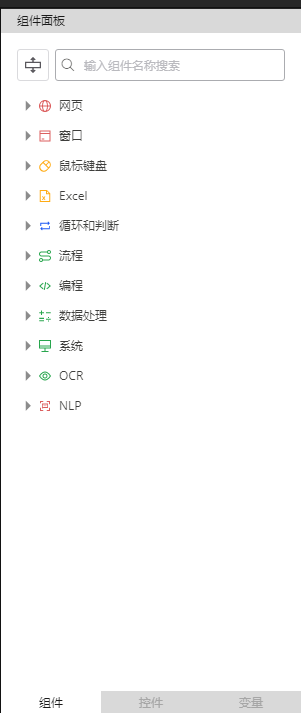
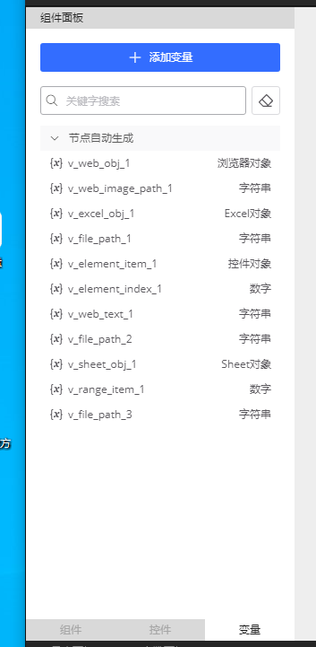
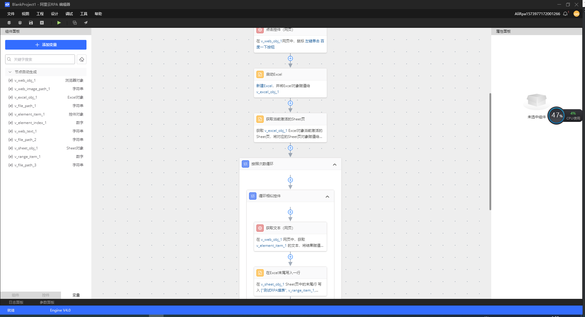
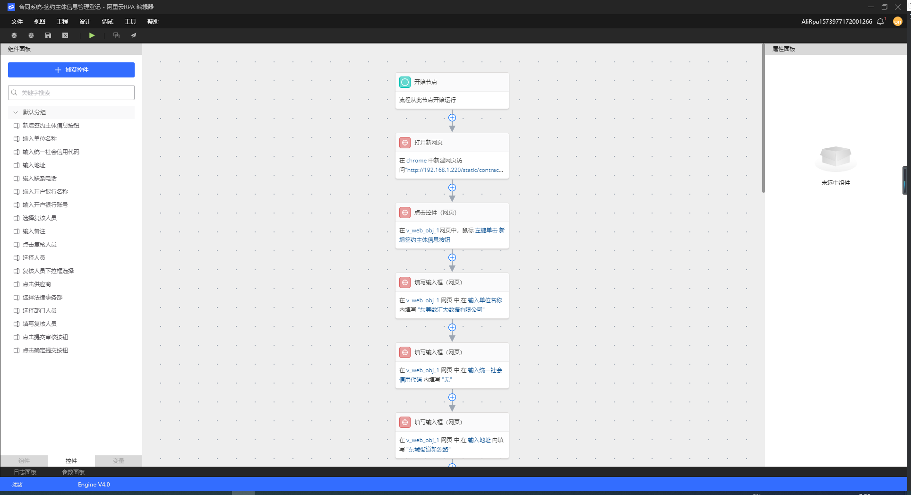
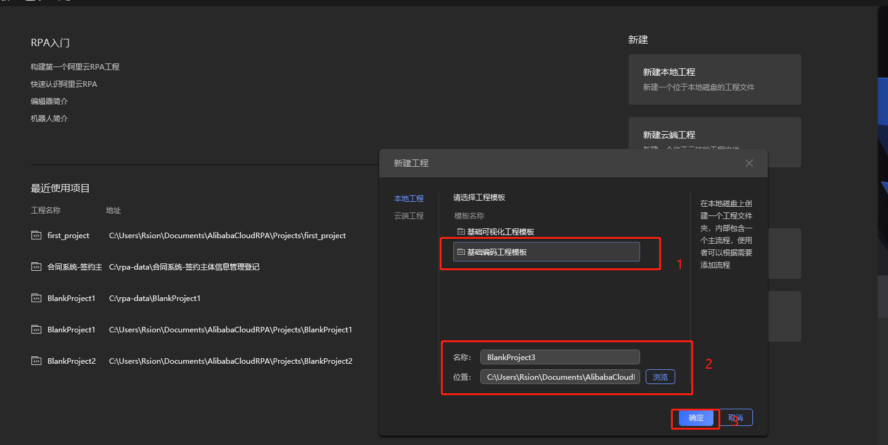
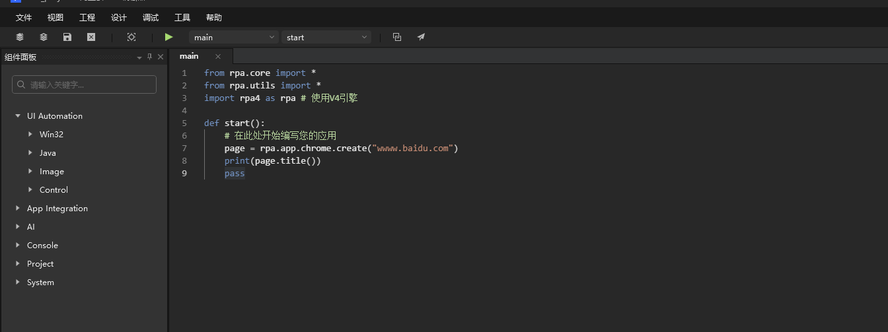
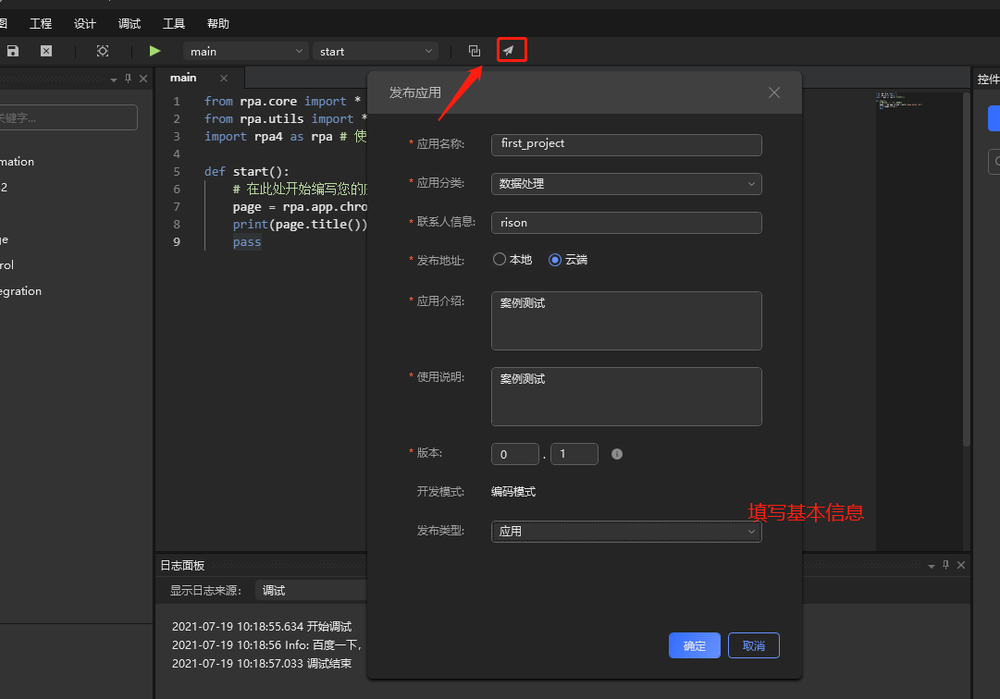

### 一、RPA 机器人自动化流程自动化

**RPA** 的全称为机器人流程自动化（Robotic Process Automation），是一款软件产品，可以模拟人在电脑的不同系统之间操作行为，替代人在电脑前执行具有规律与重复性高的办公流程。

#### 1）RPA发展历程

​        查阅资料我们会发现，在过去的4年时间里，RPA（机器人流程自动化）一词，在Gartner的搜索引擎中一直排名前五。去年Gartner发表的调查数据中显示，RPA行业在2018年保持了60％以上的增长速度，从而成为全球增长最快的智能软件。

* **RPA V1.0阶段**

  **> 实现单个业务操作自动化**

  ​        RPA发展初期，其代表应用：按键精灵。相信大家都不陌生，正如他的名字一样，通过简单的脚本制作，他可以帮助你完成一系列的鼠标按键操作，所以很多游戏玩家喜欢用它来自动打怪升级，当然在工作中，它也可以帮助员工去完成一系列通过点击就可以完成的操作，比如说自动收发邮件、自动调整文档格式等以提升员工工作效率。在这一阶段，RPA几乎涵盖了桌面自动化软件的全部操作，但按键精灵并不能实现多部门合作的业务流程，不能将若干个部门合作的某一业务形成“闭环”，实现端到端的自动化。

* **RPA V2.0阶段**

  **> 实现夸部门协同工作**

  ​        与第一阶段不同，在这一阶段，RPA可以完成一系列的业务流程，并且不受系统软件的控制，游走在各个软件的表面层进行工作，代替人机交互，释放出更多的可能性。

  ​        某财险，每天需要投入200人在各个软件系统之间，对公司客户数据进行相应的查询、汇总、录入、整理、发送等，人工对每个客户操作耗时大概30分钟，此分公司约有20000个客户，每次操作共耗时：30*20000/60=10000小时！

  ​        而借助阿里云RPA的力量，一次录入只需要3分钟，整个流程只需要1个人，整体效率提升900%，从这数据可以看出，阿里云RPA的工作量相当于80个人在同时工作。

* **RPA V3.0阶段**

  **> RPA"上云"**

  ​       曾经美国计算机行业协会做过一次调查，有将近一半的公司表示其31%至60%的IT系统是基于云计算的。81%的公司表示云计算已经显著增强或适度增强了他们在自动化方面的工作。在云计算被炒的火热的今天，众多企业纷纷选择上“云”，开启企业服务业务云端化旅程。RPA弱耦合的特性能够实现跨软件低成本地快速部署，这也造就了RPA上云的必然性—第三阶段——云上RPA。

  ​        云计算不仅为RPA带来了算力的支撑，还节约了其部署成本，另外把RPA部署到云上，不仅没有了软件客户端和场地的限制，一些IT工作人员也可以不用参与其中，在这些技术人员看来，云上的RPA软件始终是最新的，省去了在本地计算机上进行升级的步骤。例如阿里云RPA，已实现在云端运行，远程控制且不占用现有的电脑，并且把RPA部署在云服务器和SaaS上可以实现自动分级、动态负载平衡、情景感知、高级分析和工作流。

* **RPA V4.0阶段**

  **> RPA + AI**

  ​        由于AI智能领域的高速发展，客户对RPA产品的需求已经不仅仅局限于模仿人类基本电脑操作、读写用户界面的能力了。客户需要RPA可以完成从刚开始的执行层到决策层的自我升华，自主开展并完成团队的协同工作。

  ​        AI强大的视觉识别技术可以帮助RPA更加精准的识别并筛选关键图片以及视频信息。目前市场上很多银行、信贷等金融行业对于如何快速完成资料审核一直以来都投入很大程度的关心。审核资料格式多、篇幅长、种类多等业务痛点。阿里云RPA利用阿里达摩院强大的OCR（图像文字识别技术）技术可以帮助客户完成合同审核、材料审核、用户身份证识别、银行卡识别等业务流程，在很大程度上提升了客户工作效率，节约人力成本。

  ​        目前阿里云RPA已经完成从3.0到4.0的规划，未来阿里云RPA将更好的将阿里达摩院技术合理赋能到RPA 技术上，完成阿里云RPA的质的飞跃，未来阿里云RPA将试用与越来越多的行业、场景。

 #### 2）RPA的优势

* 容易上手

  不同行业的不同场景职位，其工作流程都是不一样的，所以为了满足客户的不同需求，阿里云RPA开发支持可视化、编码两种开发模式，其强大的可视化开发能力，可以做到开箱即用，即使你不懂技术，没有技术基础，但是只要有业务流程、会简单的电脑操作，那么它就可以满足你的需求。而传统的自动化技术是需要客户有强大的技术编码能力，并且编码语言还要随着使用的自动化工具不同而做出不同的调整，相比较而言难度是很高

* 只运行在表面层级，不改变原有的IT系统

  现在我们办公都会利用各种各样的软件、系统以帮助我们提高工作效率，但是这些系统软件之间又是不通的，这就导致了我们一些工作人员想要完成一件事情需要游走在各个软件之间。而阿里云RPA就不同了，它只是模拟人工点击鼠标、复制、粘贴等的一些正常操作，并且他只运行在软件表面层级，不会侵入影响已有的软件系统的功能与稳定性。通俗的说，RPA是被大家信赖的安全的“外挂”一样的存在。

* 快速部署

  传统的自动化当中，其可行性研究设计和POC验证就花费了大量的时间，而RPA则不同，它是受过程驱动的，阿里云RPA平均孵化一个客户只需要数周的时间，便可以帮助客户实现从定义到上线的全过程。

* 快、很、准

  快即工作效率高；我们知道RPA是一个软件，它跟人类不同，首先它不知疲倦，7x24小时全年无休孜孜不倦的工作。其次它完全不会受心情、身体情况影响工作，也不会出现跟同事聊天、暗中偷懒的事情，再次其工作严谨，出错率基本为0，与人工相比，效率提升不止一点点。
  准即工作准确率高；人力办公，稍有不注意就会出现这样那样的误差，但是RPA绝不会出现这样的情况。以阿里云RPA为例，购买产品之后，通过人工设置工作流程，RPA就可以按照流程去完成工作，如果设置的流程是正确的，那么RPA执行的结果也100%是正确的。
  狠即绝对理性！RPA是一款机器软件，它做事情完全不用考虑人情世故，更不知疲惫，一年365天，一天24小时全年无休的工作。你说它是不是个狠人？

### 二、快速入门

#### 1）百度一下demo

* 创建一个本地工程或者云端工程，创建可视化工程模板

  

* 基础组件

  

  

  

  

  

* 运行结果

  

#### 2）基础可视化工程模板

> 合同系统-签约主体信息管理登记demo

* 创建本地或者云端工程

  

* 基础组件搭建

  

* 运行自动填写表单，提交审批

  

  

#### 3）基础编码工程模板

> demo

* 创建本地或者云端工程

  

* 编写代码

  

* 调试日志

  

* 发布工程

  

### 三、SDK使用

#### 1）ai

~~~python
from rpa.core import *
from rpa.utils import *
import rpa4 as rpa # 使用V4引擎

def start():

    #   ml
    # structure_data(image_path, template_id)
    # 方法描述
    # 结构化模板数据识别
    # 参数说明
    # image_path<str>图片路径
    # template_id<str>结构化模板id
    # 返回值说明
    # 返回结构化识别结果<dict>
    # 调用样例- rpa.ai.ml.structure_data-

    # path = r"C:\Users\Rsion\Desktop\pic\微信图片_20210719142724.png"
    # rpa.ai.ml.structure_data(path,"图片")
    

    #   ocr
    # element_text(element, element_index=1, engine='google', window=None, eliminate_spaces=False)
    # 方法描述
    # 在控件区域中，通过ocr获取所有文本
    # 参数说明
    # element<str>控件名
    # element_index<int>控件位置
    # engine<str>引擎
    # 可选项：
    # google : 谷歌
    # aliyun : 阿里云
    # paddle : 飞桨
    # eliminate_spaces<bool>是否去掉识别结果中的空格
    # window<object>控件所在窗口对象
    # 返回值说明
    # 返回识别结果<str>
    # 调用样例- rpa.ai.ocr.element_text-

    # page = rpa.app.chrome.create("www.taobao.com")
    # text = rpa.ai.ocr.element_text("ocr控件-淘宝", engine='aliyun')
    
    # click(element, keyword, element_index=1, keyword_index=1, engine='google', button='left', offset_x=0, offset_y=0, window=None, timeout=15)
    # 方法描述
    # 在控件区域中，通过ocr找到keyword的子区域，并对子区域的中心点为坐标，模拟鼠标点击
    # 参数说明
    # element<str>控件名
    # keyword<str>关键词
    # element_index<int>控件位置
    # keyword_index<int>关键词位置
    # engine<str>引擎
    # 可选项：
    # google : 谷歌
    # aliyun : 阿里云
    # paddle : 飞桨
    # button<str>鼠标键位
    # 可选项：
    # left : 左键
    # right : 右键
    # offset_x<int>横向偏移量
    # offset_y<int>纵向偏移量
    # window<object>控件所在窗口对象
    # timeout<int>超时时间
    # 调用样例- rpa.ai.ocr.click-

    # 注意事项：
    # 1. 使用此方法前需要先通过捕捉控件功能捕捉对应控件
    # 2. 执行时，需要确保控件所在的页面是打开状态
    # 3. 此方法会在指定控件上，识别指定的关键词文本，以识别结果为原点，根据设定的偏移量移动鼠标，然后执行模拟点击。
    # 代码调用样例如下，本例中从页面元素上识别关键词"文档"，随后将鼠标移动到关键词上执行模拟点击动作：
    # page = rpa.app.chrome.create('www.aliyun.com')
    # rpa.ai.ocr.click('阿里云右上角banner-chrome','文档',engine='paddle',offset_x=0,offset_y=0,timeout=200)

    #id_card(image_path)
    # 方法描述
    # 身份证识别
    # 参数说明
    # image_path<str>身份证图片路径
    # 返回值说明
    # 返回识别结果<CardFront>
    # 调用样例- rpa.ai.ocr.id_card-
    # 注意事项：内置SDK使用的OCR能力需要额外购买，使用前请在控制台-授权管理-AI中确认是否已授权
    # 代码调用样例如下：
    # image_path = r'C:\Users\Rsion\Desktop\pic\1b4c510fd9f9d72af7d58f51da2a2834359bbbcd.png'
    # id_card_data = rpa.ai.ocr.id_card(image_path)

    pass
~~~

**ocr 身份证信息api调用**

~~~python
#!/usr/bin/env python
# -*- coding: utf-8 -*-

import sys,os
import base64
import json

from urllib.parse import urlparse
import urllib.request
import base64

ENCODING = 'utf-8'

def get_img_base64(img_file):
    with open(img_file, 'rb') as infile:
        s = infile.read()
        return base64.b64encode(s).decode(ENCODING)

def predict(url, appcode, img_base64, kv_configure):
        param = {}
        param['image'] = img_base64
        if kv_configure is not None:
            param['configure'] = json.dumps(kv_configure)
        body = json.dumps(param)
        data = bytes(body, "utf-8")

        headers = {'Authorization' : 'APPCODE %s' % appcode}
        request = urllib.request.Request(url = url, headers = headers, data = data)
        try:
            response = urllib.request.urlopen(request, timeout = 10)
            return response.code, response.headers, response.read()
        except urllib.request.HTTPError as e:
            return e.code, e.headers, e.read()

def demo():
    appcode = 'd0d6fe7xxxxxxxxxxxxxxe6d19a64'
    url = 'http://dm-51.data.aliyun.com/rest/160601/ocr/ocr_idcard.json'
    img_file = r'C:\Users\Rsion\Desktop\pic\1b4c510fd9f9d72af7d58f51da2a2834359bbbcd.png'
    configure = {'side':'face'}
    #如果没有configure字段，configure设为None
    #configure = None

    img_base64data = get_img_base64(img_file)
    stat, header, content = predict( url, appcode, img_base64data, configure)
    if stat != 200:
        print('Http status code: ', stat)
        print('Error msg in header: ', header['x-ca-error-message'] if 'x-ca-error-message' in header else '')
        print('Error msg in body: ', content)
        exit()
    result_str = content

    print(result_str.decode(ENCODING))
    #result = json.loads(result_str)

if __name__ == '__main__':
    demo()
~~~

#### 2）app
#### 3）console
#### 4）project
#### 5）system
#### 6）ui

